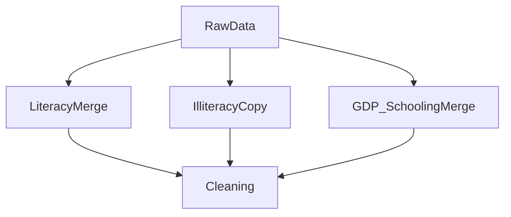

# 📊 Data Understanding & Preprocessing  
_Global Literacy & Education Trends_

---

## 🎯 Objective

This report documents the complete **data acquisition, structural audit, and deterministic cleaning pipeline** used to prepare five heterogeneous datasets for analysis.

> 🧠 **Engineering Principle**  
> Data trustworthiness is not assumed — it is verified.  
> Every dataset was independently audited before any merge was attempted.

This stage defines the **analytical integrity** of all downstream EDA, Feature Engineering, SQL, and Power BI dashboards.

---

# 1️⃣ Data Sources & Acquisition

## 🌍 Source Platforms
- Our World in Data (OWID)
- World Bank
- UNESCO UIS

All datasets were programmatically downloaded using a custom `download_csv()` function with a browser-mimicking `User-Agent` header to bypass network restrictions.

```python
headers = {"User-Agent": "Mozilla/5.0"}
response = requests.get(url, headers=headers)
```

Files were stored under:

```
data/raw/
```

📌 No transformations were applied at download time — preserving raw fidelity.

---

## 📦 Raw Dataset Inventory

| DataFrame | Dataset | Source | Raw Shape | Key Columns |
|------------|----------|----------|------------|--------------|
| `df_alr` | Adult Literacy Rate | OWID / UNESCO | 1,725 × 4 | entity, code, year, adult_literacy_rate |
| `df_ylr` | Youth Literacy (M/F) | OWID / UNESCO | 2,002 × 6 | entity, code, year, youth_m, youth_f, region |
| `df_ip` | Illiterate Population | OWID | 2,059 × 5 | entity, code, year, illiteracy_rate |
| `df_gc` | GDP per Capita (PPP) | OWID / WB | 7,240 × 5 | entity, code, year, gdp |
| `df_ays` | Avg Years of Schooling | OWID | 5,365 × 7 | entity, year, avg_yrs_edu |

---

# 2️⃣ Structural Audit

Before cleaning, each dataset was profiled for:

- Shape
- Dtypes
- Year coverage
- Unique entity count
- Null distribution
- Duplicate integrity

---

## 📆 Year Range Analysis

⚠️ Extreme temporal mismatch detected.

| Dataset | Min Year | Max Year | Usable Range | Impact |
|----------|-----------|-----------|---------------|---------|
| Literacy | 1970 | 2023 | 1990–2023 | Low loss |
| Illiteracy | 1475 | 2023 | 1990–2023 | High loss |
| GDP | 1990 | 2024 | 1990–2023 | Trimmed 2024 |
| Schooling | 1475 | 2023 | 1990–2023 | High loss |

> 🔍 **Design Decision**  
> 1990–2023 was chosen as the intersection window where GDP data begins.

This prevents:
- GDP-only records
- Historical literacy-only centuries
- Inconsistent join logic

---

# 3️⃣ Entity Taxonomy Audit

Each dataset mixed:

- ✅ Countries
- 🌎 Regions
- 💰 Income groups
- 🏛 Historical states
- 🌍 World aggregates

Example non-country entities:
- "Sub-Saharan Africa (WB)"
- "Low-income countries"
- "USSR"
- "Yugoslavia"
- "EU-27"

> ⚠️ Key Risk: Mixing country-level data with aggregates distorts correlation & ranking analysis.

---

# 4️⃣ Missing Value Classification

Nulls were categorized into two structural classes:

| Class | Description | Treatment |
|--------|-------------|------------|
| Structural | Region/income groups lacking ISO code | Removed via entity filtering |
| Coverage Gap | Survey-year absence | Interpolate or drop |

---

## 📊 Critical Null Observations

- `avg_schooling_years` → 89% null pre-filter
- `literacy_rate` (in schooling df) → redundant → dropped
- `population` → 80% null → removed
- `adult_literacy_rate` → 26% null → interpolated
- GDP → 0.8% null → interpolated

> 🧠 Insight: Nulls were not random — they were historically structured.

---

# 5️⃣ Duplicate Integrity

All datasets checked for full duplicates:

```python
df.duplicated().sum()
```

✅ Result: **Zero duplicates across all datasets**

Composite natural key:

```
(country, year)
```

---

# 6️⃣ Merge Architecture

Three consolidated analytical DataFrames were created.



---

## 📘 6.1 df_literacy

**Merge:** OUTER JOIN  
**Keys:** entity, code, year  
**Shape:** 2,019 × 7  

> 🔎 Rationale: Preserve adult-only and youth-only records.

---

## 📗 6.2 df_illiteracy

Direct copy of `df_ip`.

> 🧠 No merge needed — self-contained dataset.

---

## 📙 6.3 df_gdp_schooling

**Merge:** OUTER JOIN  
**Keys:** entity, code, year, region  
**Shape:** 11,113 × 8  

> 🛡 Including region prevented label collision.

---

# 7️⃣ Cleaning Pipeline (8 Stages)


---

## 🗓 Stage 1 — Year Filtering

```python
df = df[(df['year'] >= 1990) & (df['year'] <= 2023)]
```

| DataFrame | Raw | After Filter | % Retained |
|------------|------|--------------|------------|
| Literacy | 2,019 | 1,712 | 84.8% |
| Illiteracy | 2,059 | 1,419 | 68.9% |
| GDP-Schooling | 11,113 | 7,884 | 70.9% |

---

## 🏷 Stage 2 — Column Standardization

Verbose OWID names were renamed:

| Raw | Clean |
|------|--------|
| entity | country |
| ny_gdp_pcap_pp_kd | gdp |
| avg_years_of_education | avg_schooling_years |

> 🧠 Necessary for SQL schema compatibility.

---

## 🚫 Stage 3 — Aggregate Removal

Explicit allowlist used (no regex).

Entities removed:
- WB regions
- Income tiers
- SDG zones
- Historical states
- Continental aggregates

✅ Validation: `set()` intersection returned empty.

---

## 🌍 Stage 4 — Region Imputation

10 countries lacked continent labels due to outer join propagation.

Manual dictionary applied.

```python
continent_map = {
    "Antigua and Barbuda": "North America",
    "East Timor": "Asia"
}
```

✅ Post-validation: zero null continent values.

---

## 🧮 Stage 5 — Missing Value Strategy

### Adult Literacy
- Drop countries with 100% missing
- Interpolate remaining
- Forward/backward fill edges

### GDP
- Log-transform before Z-score
- Interpolate sparse gaps

### Schooling
- Drop ratio=1.0 countries
- Interpolate remainder

> 🚫 No mean/median imputation — preserves cross-country variance.

---

# 8️⃣ Logical Constraint Validation

Flags retained for audit transparency.

| Constraint | Violations |
|------------|------------|
| Literacy ∈ [0,100] | 0 |
| GDP ≥ 0 | 0 |
| Schooling ≥ 0 | 0 |

```python
df['invalid_flag'] = (df['literacy'] < 0) | (df['literacy'] > 100)
```

---

# 9️⃣ Outlier Detection

## 📉 GDP (Log-Z Score)

```python
df['log_gdp'] = np.log(df['gdp'])
z = (df['log_gdp'] - mean) / std
```

| Result | 0 Outliers |

---

## 📊 Literacy (IQR Method)

```python
Q1 = df[col].quantile(0.25)
Q3 = df[col].quantile(0.75)
IQR = Q3 - Q1
```

| Column | Outliers | % |
|---------|----------|-----|
| Adult Literacy | 40 | 3.6% |
| Youth Male | 107 | 9.7% |
| Youth Female | 130 | 11.8% |

> 🚨 Insight: Female youth literacy shows highest structural inequality concentration.

---

# 🔚 Final Cleaned Dataset Summary

| DataFrame | Final Rows | Final Columns |
|------------|------------|---------------|
| df_literacy | 1,103 | 11 |
| df_illiteracy | 833 | 8 |
| df_gdp_schooling | 4,963 | 11 |

---

# 📉 Row Reduction Traceability

| Stage | Literacy | Illiteracy | GDP-Schooling |
|--------|----------|------------|---------------|
| Raw | 2,019 | 2,059 | 11,113 |
| Final | 1,103 | 833 | 4,963 |
| % Retained | 54.6% | 40.5% | 44.7% |

> 🎯 Reduction = Scope precision, not data loss.

---

# 💡 Key Engineering Insights

### 📊 Coverage Asymmetry
GDP data is dense; literacy is survey-based and sparse.

### 🌍 Entity Complexity
OWID mixes granular and aggregate entities — filtering required.

### 📈 Historical Depth
Schooling data reveals near-flat education levels pre-1900.

### 🔐 ISO Code Reliability
Country name was more reliable than ISO code for joins.

### ✅ Zero Duplicates
Outer joins safe due to unique (country, year) key.

---

# 🏁 Conclusion

The cleaned datasets are:

- Structurally validated
- Logically constrained
- Outlier-audited
- Fully reproducible
- SQL-ready
- Analysis-ready

These serve as canonical inputs for:

- 📊 EDA  
- 🧠 Feature Engineering  
- 🗄 SQL Analytics  
- 📈 Power BI Dashboards  

---
