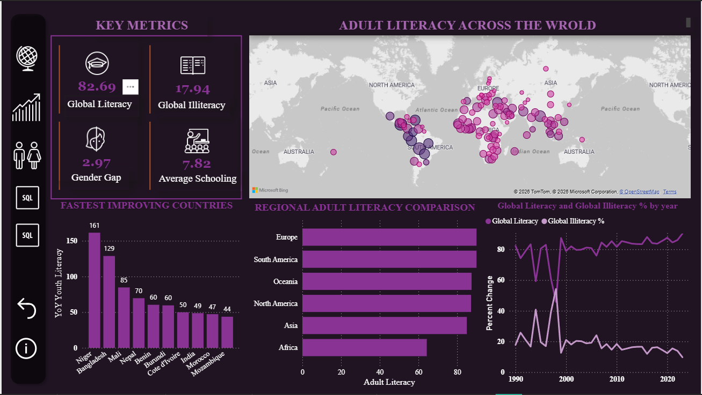
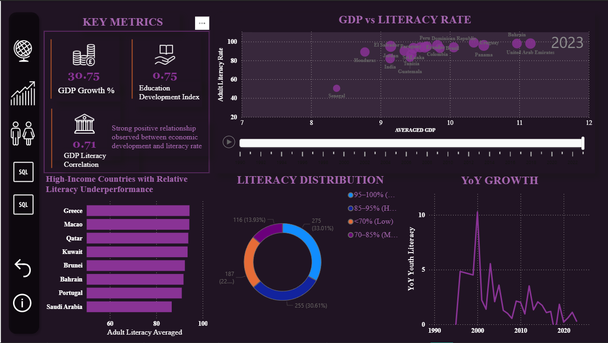
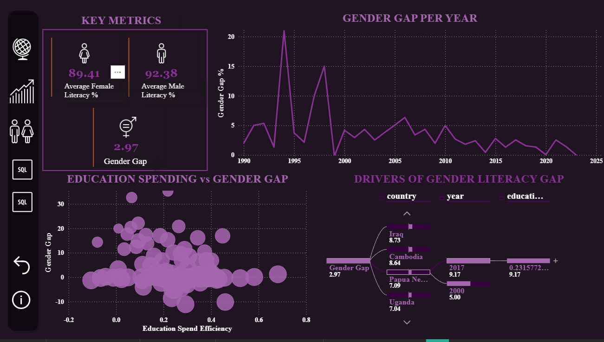
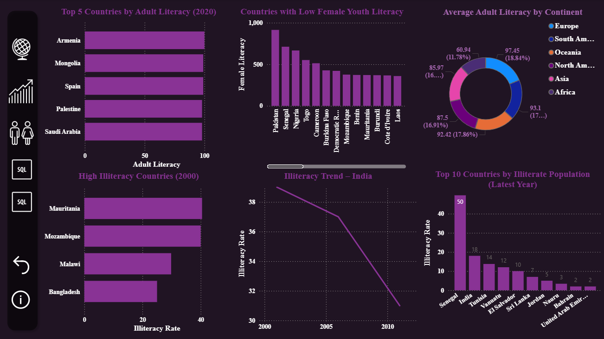
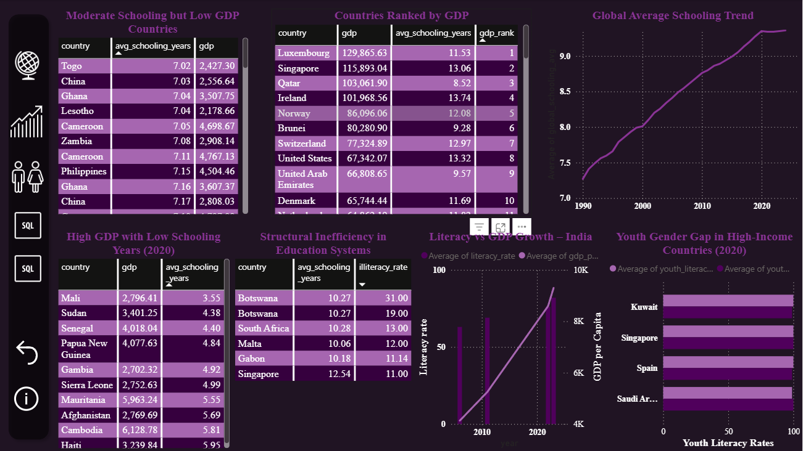

# 📊 Power BI Dashboard Showcase  
_Global Literacy & Education Trends (1990–2023)_

> This document explains the Power BI dashboard page-by-page, including visuals used, slicer/interaction logic, DAX measures, and drill-through behavior.  
> **Theme:** convert cleaned + engineered indicators into stakeholder-friendly, interactive decision views.

---

## 🧭 How to read this dashboard

### Navigation
A left-side vertical icon bar provides page navigation:
- 🌍 Global overview
- 📈 GDP ↔ Literacy relationship
- 👩‍🎓 Gender gap analytics
- 🧮 SQL outputs (Literacy + Illiteracy)
- 🧮 SQL outputs (GDP + Schooling + joins)

### Recommended interactions
- Use **Year** slicer/slider to see shifts over time.
- Click any **country** in a chart to cross-filter the entire page.
- Use **tooltips** to read exact values.
- Use **drill-through** (country) to open detailed country-level story pages (explained below).

---

#
# 🎛 Slicers & Filter Logic

### Global slicers used across pages
- **Year** (timeline slider / play axis): filters all visuals on the page.
- **Continent/Region**: filters map + comparisons.
- **Country**: used in decomposition tree and drill-through.

### Cross-filter behavior
- Clicking a country on the **map** filters:
  - fastest improving list
  - regional comparison
  - trend line
- Clicking a bar in rankings filters the map and trend line.
- KPI cards update dynamically with filters.

---

# 🧷 Drill-through Logic (Country Deep Dive)

### What drill-through is used for
When a user right-clicks a country in any visual and selects **Drill-through → Country Profile**, the dashboard opens a detail view where:
- Country is locked as filter context
- Year remains selectable
- Driver visuals (like decomposition tree) explain **why** that country looks the way it does

### Drill-through configuration (recommended)
1. Create a page named: **Country Profile**
2. Add a **Drill-through field**: `country`
3. Add visuals:
   - literacy vs time
   - GDP vs time
   - gender gap vs time
   - EDI & efficiency KPIs
4. Add a **Back button** for navigation

---

# 📄 Page-by-Page Walkthrough

---

## 🌍 Page 1 — Global Literacy Overview  
**Screenshot:** `Page_1.png`

### KPIs shown
- **Global Literacy %**
- **Global Illiteracy %**
- **Gender Gap**
- **Average Schooling Years**

### Visuals
- 🗺 **Map (bubble)**: “Adult Literacy Across the World”
- 📊 **Fastest improving countries** (bar)
- 📊 **Regional adult literacy comparison** (horizontal bar)
- 📈 **Global literacy vs illiteracy trend by year** (line)

### Filters / slicers
- Year (implicit through model, optional to add dropdown)
- Region/Continent (recommended)

### Key interactions
- Clicking a country bubble filters improvement rankings and region chart.
- Clicking a region bar filters the map.

### Insight supported
- Gives the macro picture: literacy is high in many countries, but the lower tail is visible geographically.
- Separates “global level” from “regional disparity” and “improvement momentum”.

---

## 📈 Page 2 — GDP vs Literacy Relationship  
**Screenshot:** `Page_2.png`

 

### KPIs shown
- **GDP Growth %**
- **Education Development Index**
- **GDP ↔ Literacy Correlation**

### Visuals
- 📌 **Scatter**: “GDP vs Literacy Rate”
- ⏳ **Year slider / play axis**: dynamic year movement
- 📊 **High-income countries with relative literacy underperformance** (bar)
- 🍩 **Literacy distribution buckets** (donut)
- 📈 **YoY growth trend** (line)

### Filters / slicers
- Year slider (central control)
- Country (click-to-filter)
- Optional: Continent slicer for regional comparison

### Key interaction
- Year slider shows how countries move in the GDP–literacy plane over time.
- Selecting a country highlights its relative position vs peers.

### Insight supported
- Strong positive relationship, but visible outliers:
  - high GDP with lower-than-expected literacy = policy/institution gap
  - moderate GDP with high literacy = efficient system

---

## 👩‍🎓 Page 3 — Gender Gap Analytics  
**Screenshot:** `Page_3.png`  

### KPIs shown
- **Average Female Literacy**
- **Average Male Literacy**
- **Gender Gap**

### Visuals
- 📈 **Gender gap per year** (trend line)
- 🫧 **Education spend efficiency vs gender gap** (bubble scatter)
- 🌳 **Decomposition Tree**: “Drivers of Gender Literacy Gap”
  - splits by **country**, **year**, and education variables

### Filters / slicers
- Country
- Year
- (Optional) Continent

### Key interaction
- Decomposition tree lets user identify which combinations of country/year drive gap extremes.
- Scatter helps find where higher efficiency still coincides with gaps (structural inequality vs funding).

### Insight supported
- Gender inequality is not uniform; it clusters.
- You can locate “persistent gap” systems vs improving ones.

---

## 🧮 Page 4 — SQL Outputs (Literacy + Illiteracy Queries)  
**Screenshot:** `Page_4.png`  

### Visuals aligned to SQL tasks
- ✅ **Top 5 countries by adult literacy (2020)** (bar)
- ✅ **Countries with low female youth literacy** (bar)
- ✅ **Average adult literacy by continent** (donut)
- ✅ **High illiteracy countries (2000)** (bar)
- ✅ **Illiteracy trend – India** (line)
- ✅ **Top 10 countries by illiterate population (latest year)** (bar)

### Filters / slicers
- Year selector (for 2020 / 2000 / latest)
- Country selector (for India trend)

### Key interaction
- This page is the “SQL-to-visual validation layer”.
- Each chart corresponds to a query output exported from your SQL database folder (`powerbi/SQL_database/Q*.csv`).

### Insight supported
- Demonstrates your ability to operationalize SQL analytics into executive visuals.

---

## 🧮 Page 5 — SQL Outputs (GDP + Schooling + Joins)  
**Screenshot:** `Page 5.png`  

### Visuals aligned to SQL tasks
- ✅ **Moderate schooling but low GDP countries** (table)
- ✅ **Countries ranked by GDP** (table)
- ✅ **Global average schooling trend** (line)
- ✅ **High GDP but low schooling years (2020)** (table)
- ✅ **Structural inefficiency in education systems**  
  (high schooling + high illiteracy rate) (table)
- ✅ **Literacy vs GDP growth – India** (combo chart)
- ✅ **Youth gender gap in high-income countries (2020)** (bar)

### Filters / slicers
- Year (2020 emphasis)
- Country (India focus)
- Optional: continent filter for structural inefficiency exploration

### Key interaction
- Tables provide “audit-style” analyst credibility.
- The India growth chart bridges macro + single-country narrative.

### Insight supported
- Highlights paradox cases:
  - schooling not translating to literacy
  - wealth not translating to education depth
  - high-income gender gaps still present in specific systems

---

# ✅ What this dashboard proves (skills)
- **Data storytelling**: macro → regional → anomaly → deep dive
- **Statistical maturity**: log GDP, growth noise handling, multi-year indicators
- **Feature engineering applied in BI**: EDI, efficiency, momentum, gender gap
- **SQL → BI pipeline**: query outputs are directly visualized
- **Interactive design**: slicers + cross-filter + decomposition tree + drill-through

---